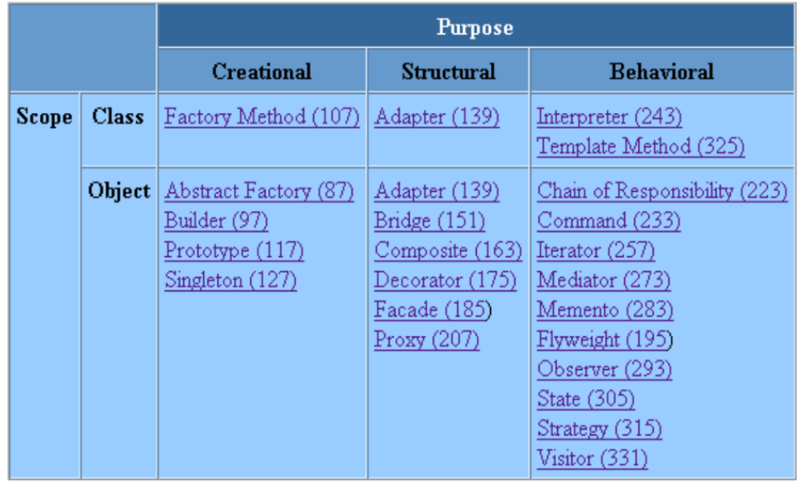

# Design Patterns — Java & UML

A hands-on exploration of the Gang of Four (GoF) design patterns implemented in Java, with UML class diagrams for each pattern.

---

## What is a Design Pattern?

# Definition

Each pattern describes a problem which occurs over and over again in our environment, and
then describes the core of the solution to that problem, in such a way that you can use this
solution a million times over, without ever doing it the same way twice —1 Christopher Alexander

Description d'un problème récurrent et sa solution
— Chaque «pattern » décrit :

1. un problème qui arrive encore et encore,
2. l'idée de sa solution
   (Solution qui peut être utilisée plusieurs fois sans être deux fois identique.)
3. Ses conséquences (avantages et inconvénients)
   Un patron de conception comprend des éléments essentiels.
   Les quatre éléments essentiels d'un patron
   Son nom
   — Ilest important, car une fois admis, il décrit le problème et sa solution par sa seule évocation.
   — Il permet à tous de parler un langage commun.
   Le problème
   — Il décrit la situation dans laquelle s'applique la solution.
   — Il exprime le problème et son contexte.
   — Il peut ajouter une liste de conditions à remplir pour l'appliquer.
   La solution
   — Elle décrit les éléments du concept, leur relation, leur responsabilité, leur collaboration.
   — Elle est abstraite mais applicable dans de nombreux cas concrets.
   Les conséquences
   — Ils expriment les avantages et inconvénients.

---

## Project Structure

```
design_patterns/src/
├── creational/
│   └── singleton/          # Singleton pattern
├── behavioral/
│   ├── command/            # Command pattern
│   ├── iterator/           # Iterator pattern
│   ├── observer/           # Observer pattern (+ météo exercise)
│   ├── state/              # State pattern
│   └── strategy/           # Strategy pattern
└── strucutural/
    ├── adapter/            # Adapter pattern (student example)
    ├── composite/          # Composite pattern (graphic shapes)
    └── decorator/          # Decorator pattern
```

Each pattern folder contains:
- Java source files (interfaces, concrete classes, a `Main.java` entry point)
- A UML class diagram (PNG)

---

## Implemented Patterns

### Creational

| Pattern | Description |
|---------|-------------|
| **Singleton** | Ensures a class has only one instance and provides a global access point to it. |

### Behavioral

| Pattern | Description |
|---------|-------------|
| **Command** | Encapsulates a request as an object, allowing parameterization and queuing of requests. |
| **Iterator** | Provides a way to sequentially access elements of a collection without exposing its representation. |
| **Observer** | Defines a one-to-many dependency so that when one object changes state, all dependents are notified. |
| **State** | Allows an object to alter its behavior when its internal state changes. |
| **Strategy** | Defines a family of algorithms, encapsulates each one, and makes them interchangeable. |

### Structural

| Pattern | Description |
|---------|-------------|
| **Adapter** | Converts the interface of a class into another interface that clients expect. |
| **Composite** | Composes objects into tree structures to represent part-whole hierarchies. |
| **Decorator** | Attaches additional responsibilities to an object dynamically. |

---

## Getting Started

This is an Eclipse Java project. To run it:

1. **Import into Eclipse**: `File → Import → Existing Projects into Workspace`, then select the `design_patterns/` folder.
2. **Run a pattern**: Navigate to any `Main.java` inside a pattern folder, right-click → `Run As → Java Application`.

No external dependencies or build tool required — plain Java SE.

---

## UML Diagrams

Each pattern includes a UML class diagram generated alongside the implementation. Example:



---

## Resources

- *Design Patterns: Elements of Reusable Object-Oriented Software* — Gamma, Helm, Johnson, Vlissides (GoF)
- Christopher Alexander, *A Pattern Language* (origin of the pattern concept)
